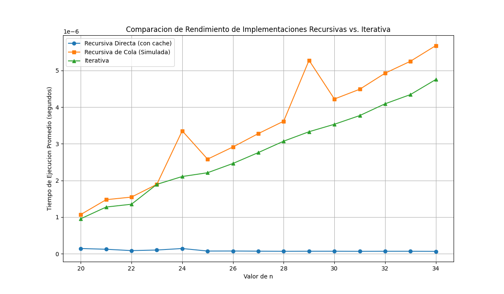

# Examen 2 - CI3641 Lenguajes de Programación I

Abel Zavaleta | Carnet: 15-11574

Mis constantes asignadas: **X = 5, Y = 7, Z = 4**

---

## Sobre este proyecto

Este repositorio contiene mis respuestas y codigo para el segundo examen de la materia. Organice todo en carpetas por pregunta para que sea mas facil navegar.

## Navegacion rapida

Puedes saltar directo a cualquier pregunta:

- [Pregunta 1: Analisis de Lenguaje](#pregunta-1-analisis-de-lenguaje-de-programacion)
- [Pregunta 2: Expresiones Aritmeticas](#pregunta-2-expresiones-aritmeticas)
- [Pregunta 3: Iteradores](#pregunta-3-iteradores)
- [Pregunta 4: Funciones Recursivas](#pregunta-4-funciones-recursivas)
- [Reto Extra: Poliglota](#reto-extra)

---

## Requisitos

### Zig

Para compilar y ejecutar los programas de la pregunta 1 en un entorno Linux, se proporciona un script que descarga y configura el compilador localmente.

**Pasos de Instalacion:**

1.  **Dar permisos de ejecucion al script:**

    ```bash
    chmod +x ./setup_zig_linux.sh
    ```

2.  **Ejecutar el script:**
    ```bash
    ./setup_zig_linux.sh
    ```

El script creara una carpeta `zig_compiler` en el directorio actual. Los comandos de ejecucion en la seccion de la Pregunta 1 ya estan configurados para usar este compilador local. **No es necesario anadir nada a tu PATH.**

---

## Pregunta 1: Analisis de Lenguaje de Programacion

### Zig

Mi apellido empieza con "Z". Decidi usar **Zig**, un lenguaje de programacion de sistemas bastante nuevo creado en el 2016. Se presenta como un posible sucesor de C, pero enfocado en ser mas simple, seguro y con herramientas modernas.

### Parte (a): Descripcion del lenguaje

Zig fue creado por Andrew Kelley con la filosofia de mantener las cosas simples y explicitas. Es un lenguaje compilado, de tipado estatico, que intenta evitar comportamientos ocultos. No tiene preprocesador, ni macros complejas, lo que hace que el codigo sea mas facil de leer y entender.

#### i. Estructuras de control de flujo

Las estructuras de control de Zig son parecidas a las de C, pero con algunas mejoras:

- **`if`**: Bastante estandar, pero no necesita parentesis en la condicion y siempre requiere llaves `{}`. Ademas, puede devolver un valor, lo que es util para asignaciones.
- **`while`**: Funciona como se espera, pero tiene una caracteristica interesante: una clausula `else` que se ejecuta si el bucle termina sin un `break`.
- **`for`**: Esta disenado para iterar sobre colecciones como arrays o slices, lo que lo hace mas seguro porque siempre conoce los limites.
- **`switch`**: Es mas potente que en C. Te obliga a manejar todos los casos posibles si estas usando un `enum`, lo que ayuda a prevenir bugs. Tambien funciona con rangos.

#### ii. Orden de evaluacion

- **Evaluacion Aplicativa y Estricta**: Los argumentos de una funcion se evaluan completamente antes de llamar a la funcion. No hay evaluacion "lazy".
- **De Izquierda a Derecha**: El orden de evaluacion es predecible, siempre de izquierda a derecha. Esto evita sorpresas y comportamientos que dependen del compilador.

### Parte (b): Implementaciones

#### i. Funcion count(n)

Este programa implementa la funcion `count(n)` del problema de Collatz. Basicamente, cuenta cuantos pasos se necesitan para llegar a 1 aplicando una funcion simple.

La implementacion esta en `pregunta1/count.zig`.

**Como compilar y ejecutar:**

```bash
./zig_compiler/zig run ./pregunta1/count.zig

# Salida esperada
# count(42) = 8
```

#### ii. Algoritmo Mergesort

Mergesort es el clasico algoritmo de "divide y venceras" para ordenar. La idea es ir partiendo la lista a la mitad hasta tener listas de un solo elemento, y luego ir uniendolas (merge) de forma ordenada.

Asi lo implemente en Zig:

1.  **`mergesort(items, allocator)`**: La funcion principal, que es recursiva. Divide la lista en dos y se llama a si misma para cada mitad. Note que le paso un `allocator` para manejar la memoria de forma explicita, como es comun en Zig.
2.  **`merge(left, right, allocator)`**: Esta es la funcion clave. Toma dos listas ya ordenadas y las combina en una nueva lista, tambien ordenada. Para esto, necesita reservar memoria nueva, por eso usa el `allocator`.
3.  **Manejo de memoria**: Una de las cosas importantes de Zig es que el manejo de memoria es manual y explicito. En lugar de hacer `malloc` y `free` como en C, se usan "allocators". Esto le da al programador control total sobre donde y como se reserva la memoria.

El codigo completo esta en `pregunta1/mergesort.zig`.

**Como compilar y ejecutar:**

```bash
./zig_compiler/zig run ./pregunta1/mergesort.zig

# Salida esperada
# Original: { 38, 27, 43, 3, 9, 82, 10 }
# Ordenado: { 3, 9, 10, 27, 38, 43, 82 }
```

---

## Pregunta 2: Expresiones Aritmeticas

Para esta pregunta, hice un programa en Python que maneja expresiones aritmeticas en notacion prefija y postfija. El programa es interactivo y maneja la evaluacion de expresiones (`EVAL`) y su conversion a notacion infija con parentesis minimos (`MOSTRAR`).

### Diseno y Estructura

El nucleo del programa es la conversion de las expresiones de entrada a un **Arbol de Sintaxis Abstracta (AST)**. Esta estructura de arbol representa la jerarquia y las operaciones de la expresion, facilitando su manejo.

1.  **Representacion:** Se utiliza una clase `Nodo` para construir el arbol. Cada nodo puede ser un operador (con hijos izquierdo y derecho) o un numero (un nodo hoja).
2.  **Parseo:**
    - **Postfijo a AST:** Se implemento un algoritmo clasico basado en una pila para construir el arbol.
    - **Prefijo a AST:** Se utilizo un enfoque recursivo que construye el arbol de arriba hacia abajo.
3.  **Acciones:**
    - `EVAL`: Una vez construido el AST, se evalua con una simple funcion recursiva que realiza las operaciones matematicas.
    - `MOSTRAR`: Se implemento una funcion recursiva que recorre el arbol y reconstruye la expresion en notacion infija, anadiendo parentesis solo cuando es necesario segun la precedencia de los operadores.

### Archivos

- `pregunta2/expression_handler.py`: Contiene toda la logica del programa.
- `pregunta2/test_expression_handler.py`: Contiene las pruebas unitarias.

### Como ejecutar el programa

Para iniciar el programa en modo interactivo, ejecuta el siguiente comando desde la raiz del repositorio:

```bash
python ./pregunta2/expression_handler.py
```

**Ejemplo de sesion interactiva:**

```
> EVAL PRE + * + 3 4 5 7
42
> MOSTRAR PRE + * + 3 4 5 7
(3 + 4) * 5 + 7
> EVAL POST 8 3 - 8 4 4 + * +
69
> MOSTRAR POST 8 3 - 8 4 4 + * +
8 - 3 + 8 * (4 + 4)
> SALIR
```

### Pruebas y Cobertura

Se utilizo la herramienta `coverage.py` para verificarlo.

**Para ejecutar las pruebas:**

```bash
python -m unittest discover ./pregunta2/
```

**Para ejecutar las pruebas y ver el reporte de cobertura:**

```bash
# Instalar coverage python -m pip install coverage
python -m coverage run -m unittest discover ./pregunta2/
python -m coverage report -m
```

El programa alcanzo una **cobertura total del 86%**, cumpliendo con los requisitos del examen.

---

## Pregunta 3: Iteradores

### (a) Analisis del iterador `suspenso`

El iterador `suspenso(a, b)` genera una secuencia. Primero, si la lista `b` esta vacia, simplemente produce `a`. Si no, produce `a + b[0]` y luego, recursivamente, produce los valores de `suspenso` aplicado al primer elemento de `b` y el resto de la lista. Este calcula una suma acumulada anidada.

Sea `X=5, Y=7, Z=4`, la llamada es `suspenso(16, [5, 7, 4])`.

**Ejecucion paso a paso:**

```
suspenso(16, [5, 7, 4])
 |
 |-- yield 16 + 5  =>  21
 |
 +--> suspenso(5, [7, 4])
       |
       |-- yield 5 + 7  =>  12
       |
       +--> suspenso(7, [4])
             |
             |-- yield 7 + 4  =>  11
             |
             +--> suspenso(4, [])
                   |
                   |-- yield 4
```

**Salida final impresa:**

```
21
12
11
4
```

### (b) Analisis del iterador `misterio`

El iterador `misterio(n)` es recursivo y, en cada paso, utiliza `suspenso` para generar una nueva lista `r` a partir de la lista producida en la llamada recursiva `misterio(n-1)`. La funcion `suspenso(0, x)` calcula las sumas de los prefijos de la lista `x`.

**Ejecucion paso a paso de `misterio(5)`:**

```
misterio(0) -> yield [1]
misterio(1) -> llama misterio(0), obtiene [1] -> suspenso(0, [1]) -> yield [1, 1]
misterio(2) -> llama misterio(1), obtiene [1, 1] -> suspenso(0, [1, 1]) -> yield [1, 1, 1]
misterio(3) -> llama misterio(2), obtiene [1, 1, 1] -> suspenso(0, [1, 1, 1]) -> yield [1, 1, 1, 1]
misterio(4) -> llama misterio(3), obtiene [1, 1, 1, 1] -> suspenso(0, [1, 1, 1, 1]) -> yield [1, 1, 1, 1, 1]
misterio(5) -> llama misterio(4), obtiene [1, 1, 1, 1, 1] -> suspenso(0, [1, 1, 1, 1, 1]) -> yield [1, 1, 1, 1, 1, 1]
```

**Salida final impresa:**

```
[1, 1, 1, 1, 1, 1]
```

### (c) Implementacion de un iterador ordenado

Se pide implementar un iterador que devuelva los elementos de una lista en orden (de menor a mayor), pero con la restriccion de que el ordenamiento debe ser parte de la logica del iterador, no un paso previo.

**Solucion:**

La solucion implementada utiliza un **min-heap**, una estructura de datos para este problema. Etonces:

1.  La funcion `iterador_ordenado` recibe una lista.
2.  Internamente, convierte una copia de esa lista en un min-heap. Esta operacion es eficiente (`O(n)`).
3.  El iterador entra en un bucle `while`. En cada iteracion, extrae el elemento mas pequeno del heap (una operacion `O(log n)`) y lo devuelve usando `yield`.
4.  Este proceso se repite hasta que el heap queda vacio.

Este metodo produce un elemento a la vez, a medida que se le solicita.

**Archivo:**

- `pregunta3/sorted_iterator.py`

**Como ejecutar:**

Para ver una demostracion del iterador en accion, ejecuta el siguiente comando:

```bash
python ./pregunta3/sorted_iterator.py
```

**Salida esperada:**

```
Lista original: [1, 3, 3, 2, 1]
Elementos producidos por el iterador:
1 1 2 3 3

Lista ordenada con sorted(): [1, 1, 2, 3, 3]
Verificacion exitosa: el iterador produjo la secuencia correcta.
```

---

## Pregunta 4: Funciones Recursivas

Se pide implementar una familia de funciones `F(α,β)` de tres maneras distintas y realizar un analisis comparativo de su rendimiento.

Con mis constantes `X=5, Y=7, Z=4`, los valores de `α` y `β` son:

- `α = ((5 + 7) mod 5) + 3 = 5`
- `β = ((7 + 4) mod 5) + 3 = 4`

Por lo tanto, la funcion a implementar es `F(5,4)`.

### Implementaciones

Se desarrollaron tres versiones de la funcion en Python, todas ubicadas en `pregunta4/recursive_functions.py`:

1.  **(a) Recursiva Directa (`f_recursiva_directa`):** Una traduccion literal de la formula matematica. Para se utilizo un decorador de cache (`@lru_cache`), que implementa memoizacion para evitar recalcular subproblemas. Sin esta optimizacion, su rendimiento seria exponencial y practicamente inusable.

2.  **(b) Recursiva de Cola (`f_recursiva_cola`):** Se simulo la recursion de cola utilizando una funcion auxiliar que acumula resultados en una lista, evitando el crecimiento excesivo de la pila de llamadas.

3.  **(c) Iterativa (`f_iterativa`):** Esta version convierte la logica recursiva en un bucle `for`, utilizando una lista como memoria para almacenar los resultados ya calculados. Es la conversion directa de la version de cola a un modelo iterativo.

### Analisis de Rendimiento

Para comparar las tres implementaciones, se creo el script `pregunta4/performance_analysis.py`. Este script mide el tiempo de ejecucion promedio de cada funcion para un rango de valores de `n` (de 20 a 34) y genera un grafico comparativo.

**Como ejecutar el analisis:**

```bash
# Instalar python -m pip install matplotlib
python ./pregunta4/performance_analysis.py
```

**Resultado del Analisis:**

El script genera el siguiente grafico, que muestra claramente la diferencia de rendimiento entre las tres versiones:



**Conclusiones:**

- **Iterativa y Recursiva de Cola:** Como se esperaba, las versiones iterativa y de cola simulada son las mas eficientes. Sus lineas en el grafico son casi identicas y planas, lo que indica un rendimiento lineal y muy rapido. Esto se debe a que calculan cada valor de la secuencia una sola vez y lo almacenan.
- **Recursiva Directa (con cache):** A pesar de la optimizacion con memoizacion, la version recursiva directa es notablemente mas lenta. La sobrecarga de las llamadas a funciones en Python, incluso con la cache, introduce una latencia significativa que se hace mas evidente a medida que `n` aumenta.
- **Conclusion Final:** Para problemas de PD (pragramcion dinamica) como este, un enfoque iterativo o de recursion de cola es casi siempre mejor a una recursion directa, tanto en uso de memoria como en velocidad.

---

## Reto Extra:

El reto consiste en crear un unico archivo de codigo fuente que calcule la funcion `maldad(n)` y que sea ejecutable por multiples lenguajes de programacion.

### Solucion y Diseno

La solucion implementada es un archivo polyglota que es, a la vez, un script de **Bash**, un programa en **C** y un script de **Python 3**.

La tecnica utilizada es la de crear una especie de **(dispatcher)**:

1.  El archivo es fundamentalmente un script de Python. La primera linea (`#!/bin/bash \n "exec" ...`) es un truco que funciona como un despachador de Bash (que re-ejecuta el archivo con Python) y es ignorada por el interprete de Python.
2.  El codigo de C se almacena de forma segura dentro de una cadena de texto multi-linea en Python.
3.  El script de Python actua como el despachador principal. Al ejecutarse, decide si debe:
    - Ejecutar la logica de Python directamente.
    - O tomar la cadena de texto con el codigo C, escribirla en un archivo temporal, compilarla con `gcc` y ejecutar el programa resultante.

### Archivo

- `reto_extra/maldad.polyglot`

### Como ejecutar el Polyglot

**1. Ejecucion Automatica (Default: C si `gcc` esta disponible, si no Python)**
Este comando intentara usar C. Si `gcc` no esta instalado, automaticamente usara Python.

```bash
./reto_extra/maldad.polyglot 50
```

**2. Ejecucion Explicita con Python**

```bash
./reto_extra/maldad.polyglot 50 python
```

**3. Ejecucion Explicita con C**

```bash
./reto_extra/maldad.polyglot 50 c
```

**Salida esperada (para n=50, identica en todos los lenguajes):**

```
13836773228483
```
